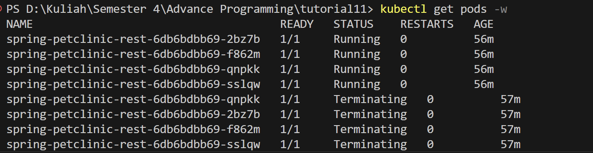

# Tutorial 11: Deployment on Kubernetes.

## Reflection 1: Hello Minikube
> Compare the application logs before and after you exposed it as a Service.
Try to open the app several times while the proxy into the Service is running.
What do you see in the logs? Does the number of logs increase each time you open the app?


Sebelum aplikasi di expose sebagai service, log hanya menampilkan `Started HTTP server on port 8080` dan `Started UDP server on port 8081`. Jumlah log yang tercatat akan bertambah hanya ketika ada interaksi langsung ke aplikasi melalui port tersebut. Setelah aplikasi di expose sebagai service Log aplikasi akan bertambah setiap kali ada request yang masuk. Kita akan melihat entri log baru setiap dibuka seperti `I0530 08:32:57.506879       1 log.go:195] GET /`. Hal ini menandakan bahwa Service telah berhasil meneruskan traffic ke pod aplikasi dan aplikasi menerima permintaan pengguna melalui service tersebut.

> Notice that there are two versions of `kubectl get` invocation during this tutorial section. The first does not have any option, while the latter has `-n` option with value set to
`kube-system`. What is the purpose of the `-n` option and why did the output not list the pods/services that you explicitly created?

Perintah kubectl get dapat dijalankan dengan atau tanpa opsi -n. Opsi -n digunakan untuk menentukan namespace saat menampilkan sumber daya di Kubernetes. Jika kita menjalankan `kubectl get pods` atau `kubectl get services` tanpa opsi apapun, maka secara default hanya objek-objek yang ada pada namespace default yang akan ditampilkan. Jika dijalankan `kubectl get pods -n kube-system`, perintah tersebut akan mengambil dan menampilkan pod-pod yang ada di namespace kube-system. pod/service dibuat pada namespace default sehingga tidak muncul pada `kubectl get pods -n kube-system`. Tujuan dari penggunaan namespace ini adalah untuk mengisolasi environment yang berbedaa.

## Refection 2: Rolling Update Deployment

> What is the difference between Rolling Update and Recreate deployment strategy?

Stategi rollng update akan mengantikan pod aplikasi yang lama ke yang baru secara bertahap. Selama proses update, pod yang lama masih bisa berjalan hingga pod yang baru benar-benar tersedia sehingga downtime bisa diminimalisir. Stategi recreate akan mematikan semua pod lama kemudian baru dibuat pod baru dan dijalankan. Proses ini akan menyebabkan downtime karena tidak ada pod yang berjalan.

> Try deploying the Spring Petclinic REST using Recreate deployment strategy and document
your attempt.

Saya mengubah strategi pada deployment.yaml dari yang sebelumnya menggunakan update
``` yaml
  strategy:
    rollingUpdate:
      maxSurge: 25%
      maxUnavailable: 25%
    type: RollingUpdate
```
menjadi menggunakan recreate
```yaml
strategy:
    type: Recreate
```


ketika dilakukan perubahan seperti pada image ia akan menghentikan semua pods yang ada hingga selesai baru aplikasi dapat digunakan kembali

> Prepare different manifest files for executing Recreate deployment strategy

Saya melakukan apply kepada deployment-recreate.yaml dan service.yaml yang telah dibuat seperti pada no 2.

>  What do you think are the benefits of using kubernetes manifest files? Recall your experience in deploying the app manually and compare it to your experience when deploying the same app by applying the manifest files (i.e., invoking `kubectl apply -f` command) to the cluster.

Deploy aplikasi secara manual akan melelahkan dan sulit diotomatisasi. Menggunakan manifest semua konfigurasi aplikasi seperti image, jumlah pod, port dan seource sudah tertulis rapi. Saat melakukan update dan deploy hanya perlu menjalankan perintah `kubectl` apply -f file.yaml. Hal ini tentu membuat kita lebih nyaman karena lebih praktis, cepat, konsisten dan mudah dikontril dibandingkan dilakukan secara manual.