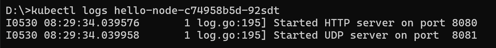
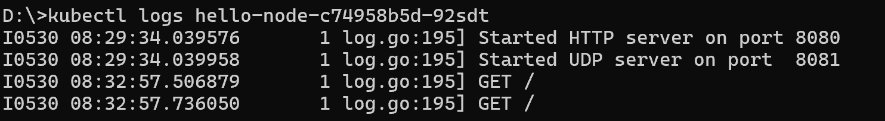

# Tutorial 11: Deployment on Kubernetes.

## Reflection 1: Hello Minikube
> Compare the application logs before and after you exposed it as a Service.
Try to open the app several times while the proxy into the Service is running.
What do you see in the logs? Does the number of logs increase each time you open the app?

Sebelum aplikasi di expose sebagai service, log hanya menampilkan `Started HTTP server on port 8080` dan `Started UDP server on port 8081`. Jumlah log yang tercatat akan bertambah hanya ketika ada interaksi langsung ke aplikasi melalui port tersebut. Setelah aplikasi di expose sebagai service Log aplikasi akan bertambah setiap kali ada request yang masuk. Kita akan melihat entri log baru setiap dibuka seperti `I0530 08:32:57.506879       1 log.go:195] GET /`. Hal ini menandakan bahwa Service telah berhasil meneruskan traffic ke pod aplikasi dan aplikasi menerima permintaan pengguna melalui service tersebut.

> Notice that there are two versions of `kubectl get` invocation during this tutorial section. The first does not have any option, while the latter has `-n` option with value set to
`kube-system`. What is the purpose of the `-n` option and why did the output not list the pods/services that you explicitly created?

Perintah kubectl get dapat dijalankan dengan atau tanpa opsi -n. Opsi -n digunakan untuk menentukan namespace saat menampilkan sumber daya di Kubernetes. Jika kita menjalankan `kubectl get pods` atau `kubectl get services` tanpa opsi apapun, maka secara default hanya objek-objek yang ada pada namespace default yang akan ditampilkan. Jika dijalankan `kubectl get pods -n kube-system`, perintah tersebut akan mengambil dan menampilkan pod-pod yang ada di namespace kube-system. pod/service dibuat pada namespace default sehingga tidak muncul pada `kubectl get pods -n kube-system`. Tujuan dari penggunaan namespace ini adalah untuk mengisolasi environment yang berbedaa.